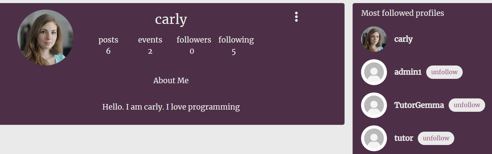

# **Clicks**

Clicks was created with the idea of creating a social media app that allows users to share posts and plan events to meet and connect with people in person. The main area I focused on was the Events area as it was different to the code institute walk-through project.

Click provides an interactive platform to create, view, edit and delete event and post informations. A user who wishes to share an event can upload information about the event, including the date, a description, a category for who it's ideally aimed at, and an image. A user who likes the event can show interest by liking the event or users can leave a review for the event if they have been to one before and would like to shar their opinions on it.

This fictional site was created for Portfolio Project #5 (Advanced Front End) - Diploma in Full Stack Software Development Diploma at the [Code Institute](https://www.codeinstitute.net).

[View live website here](https://clicks-frontend-d0ce66e4d476.herokuapp.com/)

## Table of Contents

- [Project](<#project>)
    * [Objective](<#objective>)
    * [Site Users Goal](<#site-users-goal>)
    * [Site Owners Goal](<#site-owners-goal>)
    * [Project Management](<#project-management>)

- [User Experience (UX)](<#user-experience-ux>)
    * [Wireframes](<#wireframes>)
    * [User Stories](<#user-stories>)
    * [Site Structure](<#site-structure>)
    * [Design Choices](<#design-choices>)

- [Existing Features](#features)
  * [Navigation](#navigation)
  * [Authentication](#authentication)
  * [Homepage](#homepage)
  * [Events and Posts](#events-and-posts)
  * [Create an Event or Post](#create-an-event-or-post)
  * [Event and Post Detail Page](#event-and-post-detail-page)
  * [Profile Page](#profile-page)
  * [Reusable React Components](#reusable-react-components)

- [Features Left To Implement](<#features-left-to-implement>)

- [Technologies Used](<#technologies-used>)
    * [Languages](<#languages>)
    * [Frameworks Software & Libraries](<#frameworks-software--libraries>)
    * [Libraries](<#libraries>)
- [Project Management](#project-management)
  * [Github Project Board](#github-project-board)
- [Testing](#testing)
- [Deployment](#deployment)
- [Credits](#credits)

# **Project**

## Objective

The objective of this project is to build a content sharing web application for a anyone wishing to interact with people by sharing posts and events. The platform allows users to view, create, edit, delete, comment and review on event and posts. The content can be viewed in a logical order,  filtered by category, and searched on by keywords. Users can also follow each other.

## Site User's Goal

Users can use this app to follow people they know on the app. They can share posts, like post and comment on it. All of these features can also be edited and deleted by the user as well. Users have an option to share events where they can add all the details, date, category and image of the event they would like to share and are interested for other people to take part in. Other users can like this event and comment on it as well. 

## Site Owner's Goal

As the site owner, I saw a problem in the town where I live which I have tried to solve with this platform. I want all members of the local community to be able to find out what is happening in the town in a single dedicated platform. However, not only can they simply see all the event posters listed in one place, they also have the ability to interact with the content, share opinions publicly and contact the event organisers. 

## Project Management

### Github Project Board

I've been using the project board in GitHub to keep my project together. In the initial design phase, it was really helpful to plan the project as a whole, and create the user stories based on my wireframe designs. I created a user story for each feature of the app with detials of how it can be acchieved [Project Board](https://github.com/users/fatimaqais/projects/4/views/1). 

### Database Schema

All the models have been set up in a separate DRF repository. Click [here](https://github.com/fatimaqais/clicks-backend/tree/main) to view the repository or [here](https://clicks-api-cf3d319eca2f.herokuapp.com/) to view the deployed API.

 
[Back to top](<#table-of-contents>)

# **User Experience (UX)**

## Wireframes

The wireframes for this project were not created as the project was structered very similarly to the code institute moments walk through project.

## User Stories
Here I have listed the main user stories for a user who is not logged in, or has no account and a logged in user. These user stories were then tested and confirmed in the [Testing](<#testing>) section.

### Logged Out Site User
|  | | |
|:-------:|:--------|:--------|
| As a Logged out User | I can log in so that I can interact fully with the site | &check; |
| As a Logged out User | I can sign up so that I can interact fully with the site | &check; |
| As a Logged out User | I can see a list of all events so that I can see all events that have been shared to the site | &check; |
| As a Logged out User | I can view a single event so that I can see single event details| &check; |
| As a Logged out User | I can view the top upcoming events so that I know which events have the highest going count | &check; |
| As a Logged out User | I can view the popular profiles so that I can see who has the most followers | &check; |
| As a Logged out User | I can view the details of an individual profile page so that I can see more profile data | &check; |
| As a Logged out User | I can filter events by category so that I can view only the events I'm interested in | &check; |
| As a Logged out User | I can search events by title, profile, date or tag so that I can find one particular event | &check; |
| As a Logged out User | I can view comments of an event so that I can see what other users think about the event | &check; |

### Logged In Site User
|  | | |
|:-------:|:--------|:--------|
| As a Logged in User | I can log in so that I can interact fully with the site | &check; |
| As a Logged in User | I can log out from the site so that no-one else can interact with the site using my details | &check; |
EVENTS
| As a Logged in User | I can see a list of all events and post so that I can see all events/posts that have been shared to the site | &check;
| As a Logged in User | I can view a single event or post so that I can see details of it | &check; |
| As a Logged in User | I can view the details of an individual profile page so that I can see more profile data | &check; |
| As a Logged in User |  I can see all the events/posts from one profile so that I can view all the events of one profile easily | &check; |
| As a Logged in User | I can search events/posts by title, profile or keywords so that I can find one particular event/posts | &check; |
| As a Logged in User | I can create a new event or post so that I can share it with other users| &check; |
| As a Logged in User | I can edit my event/post so that I can change the details or correct mistakes | &check; |
| As a Logged in User | I can delete my own event/post so that I can remove events from the site | &check; |
COMMENTS/Reviews
| As a Logged in User | I can view comments/reviews of an event so that I can see what other users think about the event | &check; |
| As a Logged in User | I can create a comment/reviews so that I can publicly show my thoughts about an upcoming event | &check; |
| As a Logged in User | I can edit my comments/reviews so that I can correct mistakes | &check; |
| As a Logged in User | I can delete a comment/revies that I created so that I can remove comments as I see fit | &check; |
FOLLOW
| As a Logged in User | I can follow another user so that I can see their posts/events | &check; |
| As a Logged in User | I can unfollow another user | &check; |
PROFILES
| As a Logged in User | I can view the popular profiles so that I can see who has the most followers | &check; |
| As a Logged in User | I can view the profile page of another user so that I can see more details about that user | &check; |
| As a Logged in User | I can edit my own profile page so that I can add additional information for other users to see about me | &check; |
| As a Logged in User | I can change my username and password so that I can change my login details if I feel they are not secure | &check; |
| As a Logged in User | I can change my username and password so that I can change my login details if I feel they are not secure | &check; |

[Back to top](<#table-of-contents>)

## Site Structure

Clicks is split up in two parts: when the user is logged out and when the user is logged in. Depending on login status different pages are available for the user. When the user is logged out the pages: Home, and Sign In or Up are available from the Navigation Bar menu. When the user is logged in Feed, My Events, Reviews, Signout and Profile Page also become available. 

## Design Choices

* ### Color Scheme

When deciding on the colour scheme for my site, I decided to go for very nice and welcoming colours such as pink and purple. I chose a neutral background color and complimentary pink and purple tones for the icons and buttons. 

* ### Typography

The main font used for the site is 'Merriweather' with a fallback font of Sans-Serif just in case it doesn't load. This font is nice and clear to read even though the platform in general is not text-heavy. 

[Back to top](<#table-of-contents>)

# **Existing Features**

* ## Navigation

The navigation bar is very clean and straight forward. Depending on whether you are logged in or not, different menus are visible for the site user. For tablet and mobile devices, the navigation bar menu turns into a hamburger dropdown list. 

On accessing the site for the first time, the user is logged out and the following menu items are visible:

* Clicks Logo - On the far left hand side of the navigatin bar is the Happening brand logo. This is visible throughout the site to all user types and contains a link back to the homepage. 
* Home - the first menu item, and the initial default start page, is 'Home', where all events shared among the community are displayed. 
* Events - the secind menu item, and the initial default start page, is 'Home', where all events shared are displayed.
* Authentication - Then the last two options are a sign in and signup options.

Once the user logs in, additional links become available to select:

* Add Events - Logged in users can create events and share it with others.
* Reviews - Logged in users can leave reviews and read reviews about events. Users can only leave one review on a post.
* Authentication - The icons within the authentication change once a user has logged in, and now display a link to the user's own profile page and a link to sign out of the site. 
* Add Post - Logged in users can access the post creation page to share their own post to the site. 
* Comments - Users can read and create comments on a post 

## Authentication

Users who are new to the site, or haven't previously created an account can click on the Signup Menu option on the Navigation Bar to create a user account.  I have used the standard dj-rest/auth/registration user account signup process for this. 

If a user has a Clicks account, they can click on the Signin menu option in the Navigation Bar to sign into their account.

If the user wishes to sign out, once signed in, the sign out option becomes visible in the Navigation Bar for them to select.

* ## Homepage

### Popular Profiles Component

The popular profiles component is a permanent feature across the entire site. It appears at the top of all pages. This component uses a filter to order all site users by followers count from highest to lowest. The users with the highest follower count are determined to be the most popular profiles and the top ones are displayed to other users. This feature i staken from the [code institute](https://learn.codeinstitute.net) moments project.

If the user isn't logged in, they can see avatar, and the username of the top 6 most popular profiles, and if the user is logged in, they will also see a button enabling them to follow or unfollow the profile. Due to the lack of time, I wasn't able to finish up the styling of this feature.

Each profile avatar can be clicked on to view the full profile page of that user. 

### Events and Posts

All events that are created through the Clicks sharing platform are displayed on the Homepage. All events created are requested from the API and they are ordered by the created date starting with the most recently posted and working backwards. 

Each event posting displays the user who shared it and the date it was shared. The event poster is in the center, and underneath are the event details. The event details includes the title, date, details and category of the event.

Each event has a like button and a comment showing the numbers of likes and reviews on an event.

The like button allows the user to click on the like to show they liked it and can again click on it to remove their like. By clicking on the review page user is taken to another page where they can create reviews.

By clicking on the event image or the reviews count, the user is taken to the event details page.

The post page is very similar to the events page as it also has a like and comment feature. The post page is also ordered by the most recently created posts displayed at the top of the page.

### Search

- Search - The user can search all the events listed by event title, username who posted it, or category. This allows the user to look for a post quickly and more efficiently if there is a lot of posts

* ## Create an Event or Post

If you are logged in, you are able to share new events and posts with other users. By clicking on the Add Event or Add Post menu option in the Navigation Bar, you are taken to the Share a New Event page or share new post page, where you can submit the event/post created form to the API.

All fields i bothe the models are compulsory for the users to fill as it gives back an error. The category field in create event has an option already selected for the user so they are informed to choose a category or leave it as 'general'.

* ## Event and Post Detail Page

In the event and post details page you can see just one post at a time. You can read the reviews and comments on these. You are also given an option to edit or delete your own post/event if you are logged in. This option is not visible to users who are logged out.

On the top corners the 3 dots are displayed to the user so they can make changes or delete a post.

Once the user clicks on these options these are the 2 icons displayed to them.

Below the event details is the comments section. If there are no comments yet, the user will see a message telling them that there are no comments. 

If the user is not logged in, they can read any comments that have been posted but they can't post a comment themselves unless they log in. 

Any comments that have been posted about this event are displayed, regardless of login status. If the user logs in they will see a comment form above the existing comments where they can post their own comments about the event for other users to read. 

This is the same for both the events and posts page. User can leave a review/comment if logged in. They both are very similar, only review field has an extra input option for category.

The users can edit their comments or reviews if they are logged in. 

* ## Profile Page

Throughout the site, wherever you see profile avatars, albeit in the popular profiles component, or next to events/posts, comments or reviews that have been published, you can click on the avatar to view the full profile page of that user. In the Navigation Bar, in the authentication dropdown, you can access your own profile page as well.  

The profile page shows the users total post, events, followings and followers. Due to the lack of time on thei project I wasn't able to finish up this page but it was the same as the moments app.

* ## Reusable React Components

### Three Dots Edit Delete Dropdown Menu

Based on the Moments walkthrough project 'MoreDropdown' component, I have utilised the same idea in my project but extended it's use even further to be accessed when editing or deleting events, comments and also reviews. 

# **Features Left to Implement**

- I would like to add an option where users can chat with each other. This could have been implemented if we had more time on this project.
- I would like to add an option for users upvote an event so it can be promoted more.
- I would like to add a feature where we can see how many people are attending an event.

# **Technologies Used - Frontend**

## Languages

* [HTML5](https://en.wikipedia.org/wiki/HTML) - Provides the content and structure for the website.
* [CSS3](https://en.wikipedia.org/wiki/CSS) - Provides the styling for the website.
* [JavaScript](https://en.wikipedia.org/wiki/JavaScript) - Provides interactive elements of the website
* [React.js](https://en.wikipedia.org/wiki/React_(software)) - Provides the base for the frontend components

## Frameworks, Software & Libraries
* [React Bootstrap](https://react-bootstrap.github.io/) - A CSS framework that helps build solid, responsive, mobile-first sites
* [Balsamiq](https://balsamiq.com/) - Used to create the wireframes
* [Github](https://github.com/) - Used to host the repository, store the commit history and manage the project board containing user stories and bug reports.
* [Heroku](https://en.wikipedia.org/wiki/Heroku) - A cloud platform that the application is deployed to.
* [Lighthouse](https://developer.chrome.com/docs/lighthouse/overview/) - Used to test site performance.
* [Favicon](https://favicon.io/) - Used to create the favicon.
* [Google Chrome DevTools](https://developer.chrome.com/docs/devtools/) - Used to debug and test responsiveness.
* [Cloudinary](https://cloudinary.com/) - A service that hosts image files in the project.
* [Coolors](https://coolors.co/3a405a-0cce6b-48beff-e08dac-c89933) - Used to create the colour palette
* [HTML Validation](https://validator.w3.org/) - Used to validate HTML code
* [CSS Validation](https://jigsaw.w3.org/css-validator/) - Used to validate CSS code
* [JSHint Validation](https://jshint.com/) - Used to validate JavaScript code

[Back to top](<#table-of-contents>)

# Testing

Please click [**_here_**](TESTING.md) to read more information about testing Clicks Frontend Testing

[Back to top](<#table-of-contents>)

# Deployment

### Deployment to Heroku

Once you have created a new gitpod workspace and set up the new project, you are ready to deploy to Heroku. 

1. In your heroku account, select Create New App, and give it a unique name related to your project. 
2. Select a region corresponding to where you live and click 'Create App'.
3. Head into the 'Deploy' tab select GitHub as the 'deployment method', find your project repository and click 'Connect'.
4. Click 'Deploy branch' to trigger Heroku to start building the application. 
5. Once you see the message saying 'build succeeded' you can click 'Open App' to see your application in the browser. 

### Connect React Frontend to the API backend

Once you have set up the workspace and done a basic deploy to Heroku, you can connect the react workspace to your API, in order to send data to the API.

1. In the Heroku dashboard, go into the API application settings
2. In 'Settings' add a new Config Var called 'CLIENT_ORIGIN' and set that to the URL for your deployed React application. In my case, this would be [https://clicks-frontend-d0ce66e4d476.herokuapp.com/](https://clicks-frontend-d0ce66e4d476.herokuapp.com/).
3. Then add another Config Var called 'CLIENT_ORIGIN_DEV' and enter the URL of your Gitpod preview link, remembering to remove the trailing slash at the end. Gitpod occasionally changes this URL so keep an eye on it, as you are working on your project. 
4. Go back into your frontend Gitpod workspace, and install the Axios library using the command 'npm install axios'.
5. Create a folder called 'API' and inside it create a file called 'axiosDefaults'.
6. import axios at the top of the file
7. Define your baseURL which is the unique URL of your deployed API project. In my case this would be [https://clicks-api-cf3d319eca2f.herokuapp.com/](https://clicks-api-cf3d319eca2f.herokuapp.com/)
8. Set the content-type header to multi-part/form-data as the API will need to deal with images as well as text in it's requests.
9. In order to avoid any CORS issues, set withCredentials to True.
10. Import this file into App.js to be used across all pages

### Fork this Project Repository

It is possible to make an independent copy of a GitHub Repository by forking the GitHub account. The copy can then be viewed and it is also possible to make changes in the copy without affecting the original repository. To fork the repository, follow these steps:

1. After logging in to GitHub, locate the repository. On the top right side of the page there is a 'Fork' button. Click on the button to create a copy of the original repository.

### Clone this Project Repository

A Git clone creates a linked copy of the project that will continue to synchronize with the original repository. In order to create a clone, you can click on the 'Code' button inside the selected repository and then select the 'Clone' option from the dropdown list.

[Back to top](<#table-of-contents>)

# Credits

# Acknowledgements

[Back to top](<#table-of-contents>)
