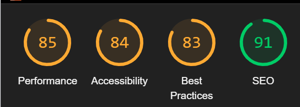

# **Clicks**

# Frontend Testing

* [**Testing**](<#testing>)
    * [Code Validation](<#code-validation>)
    * [Manual Testing](<#manual-testing>)
    * [Responsiveness Testing](<#responsiveness-testing>)
    * [Lighthouse Testing](<#lighthouse-testing>)
    * [Known Bugs](<#known-bugs>)

## Code Validation 

The Clicks site has been passed through the [W3C html Validator](https://validator.w3.org/), the [W3C CSS Validator](https://jigsaw.w3.org/css-validator/).

### W3C HTML Validation Results

No errors were found when the deployed Clicks URL was passed through W3C HTML validation checker. Only some lines of info were noted regarding the standard Meta code in the index.html file. 

### W3C CSS Validation Results

No errors or warnings were found when the deployed Clicks URL was passed through the W3C CSS Validation checker.Each css file were validated indiviadually and none of them returned an error.

## Manual Testing

I carried out the following manual tests to check all the user story scenarios:

| Status | **User Logged Out**
|:-------:|:--------|
| &check; | When user types in the posts/create or events/create they are redirected to the home page.
| &check; | User can only see the events and posts main page.
| &check; | Users can see the sign in button
| &check; | Users can see a sighn up option
| &check; | Clicking the navbar brand logo loads the home page
| &check; | Clicking the Home button on the nav bar re-loads the home page and brings to the main posts page
| &check; | Clicking the Sign In button on the nav bar loads the sign up page
| &check; | Clicking the Sign Up button on the nav bar loads the sign in page
| &check; | The user can not see the profile page link in the navigation bar profile section dropdown menu
| &check; | The user can not see the sign out link in the navigation bar profile section dropdown menu
| &check; | Users can not see the 'Add Event' button in the navigation bar
| &check; | Users can not see the 'Add Post' button in the navigation bar
| &check; | Tablet and mobile users can see the navigation bar options in a burger menu dropdown
| &check; | Clicking a link from the navigation bar links automatically closes the burger menu
| &check; | User can not sign in with false credentials - warning message displayed
| &check; | User can not sign in without filling out all the input fields - warning message displayed
| &check; | User can not sign up without filling out all the input fields - warning message displayed
| &check; | User can not sign up if the two password fields don't match - warning message displayed
| &check; | User can not sign up if the username chosen already exists in the database - warning message displayed

| Status | **Homepage - User Logged Out**
|:-------:|:--------|
| &check; | Users can view the Popular Profiles component
| &check; | Users can not view the follow button under each Popular Profile
| &check; | Clicking on a popular profile avatar, users are redirected to the selected profile page
| &check; | Users can view all events - title, description, event date, image and category
| &check; | Users can view the likes count
| &check; | Users can view all the posts details such as caption and image.
| &check; | Users can view the comments and reviews count
| &check; | Clicking on an event/post image, users are redirected to the selected event/post detail page
| &check; | Clicking on an event/post comments count, users are redirected to the selected event/post detail page
| &check; | Clicking on an event/post owner avatar, users are redirected to the selected profile page

| Status | **Event and Post Detail Page - User Logged Out**
|:-------:|:--------|
| &check; | Users can view the Popular Profiles component
| &check; | Clicking on a popular profile avatar, users are redirected to the selected profile page
| &check; | Users can view details of a single event or a post
| &check; | Clicking on an event owner avatar, users are redirected to the selected profile page
| &check; | Clicking on alike button, the users are advised to log in.
| &check; | Users can view any published comments/ eviews posted about this event or post
| &check; | Users can not see the create comment/review form

| Status | **Profile Page - User Logged Out**
|:-------:|:--------|
| &check; | Users can view the Popular Profiles component
| &check; | Clicking on a popular profile avatar, users are redirected to the selected profile page
| &check; | Users can view the number of events the profile owner has posted
| &check; | Users can view the number of posts the profile owner has posted
| &check; | Users can view the number of followers the selected profile has
| &check; | Users can view the number of other profiles the selected profile is following

| Status | **Navigation - User Logged In**
|:-------:|:--------|
| &check; | Clicking the navbar brand logo loads the home page
| &check; | Clicking the Home button on the nav bar re-loads the home page
| &check; | User can't see the sign in button in the navigation bar profile section dropdown menu
| &check; | User can't see the sign up button in the navigation bar profile section dropdown menu
| &check; | The user can see the profile page link in the navigation bar profile section dropdown menu
| &check; | The user can see the sign out link in the navigation bar profile section dropdown menu
| &check; | Users can see the Add Event menu dropdown in the navigation bar
| &check; | Users can see the Add Post menu option in the navigation bar
| &check; | Tablet and mobile users can see the navigation bar options in a burger menu dropdown
| &check; | Clicking a link from the navigation bar links automatically closes the burger menu
| &check; | User can view their avatar image next to the profile page link

| Status | **Homepage - User Logged In**
|:-------:|:--------|
| &check; | Users can view the Popular Profiles component
| &check; | Clicking on a popular profile avatar, users are redirected to the selected profile page
| &check; | Users can view the follow button under each Popular Profile
| &check; | Clicking on a popular profile follow button, users can become a follower of the selected profile
| &check; | Users can view all events/posts posted to the site - title, description, event date, image, category and caption
| &check; | Users can view the likes count
| &check; | Users can view the comments/reviews count
| &check; | Clicking on an event image, users are redirected to the selected event detail page
| &check; | Clicking on the likes button, likes count goes up and down on a toggle
| &check; | If the logged in user is the event/post owner, user can not click the like button - tooltip warning given
| &check; | Clicking on an event/post comments count, users are redirected to the selected event detail page
| &check; | Clicking on an event/post owner avatar, users are redirected to the selected profile page
| &check; | Users can search for a particular event by typing in the event title, the username of the event owner

| Status | **Add Event or Post Page - User Logged In**
|:-------:|:--------|
| &check; | Users can view the empty form to create a new event or post
| &check; | Users can upload an image into the form
| &check; | Users can change an uploaded image
| &check; | Users can't submit the form without an image - warning message displayed
| &check; | Users can't submit the form without a actegory selected on events form
| &check; | Users can't submit the form without filling out the event/post title field - warning message displayed
| &check; | Users can't submit the form without selecting an event date - warning message displayed

| Status | **Edit Event and Post Page - User Logged In**
|:-------:|:--------|
| &check; | Users can view the event/post form pre-populated with the current event/post details
| &check; | Users can upload an image into the form
| &check; | Users can change an uploaded image
| &check; | Users can't submit the form without an image - warning message displayed
| &check; | Users can't submit the form without filling out the event title, details or post caption field - warning message displayed
| &check; | Users can't submit the form without selecting an event date - warning message displayed

| Status | **Profile Page - User Logged In**
|:-------:|:--------|
| &check; | Users can view the Popular Profiles component
| &check; | Clicking on a popular profile avatar, users are redirected to the selected profile page
| &check; | Users can view the number of events and posts the profile owner has posted
| &check; | Users can view the number of followers the selected profile has
| &check; | Users can view the number of other profiles the selected profile is following
| &check; | Clicking on the event image, users are redirected to the selected event detail page
| &check; | Clicking on an event/post comments count, users are redirected to the selected event/post detail page
| &check; | Users can edit their own profile page via the three dots edit/delete menu
| &check; | On clicking edit profile, user is redirected to the edit profile page

## Responsiveness Testing

The responsive design tests were carried out manually throughout the build using Google Chrome Dev Tools. I based the main design around a desktop view, as this is primarily a browser based platform, although I have added responsive design for tablet and mobile devices as well. 

### Browser Compatibility 

Clicks was tested on the following browsers:

- Google Chrome
- Microsoft Edge
- Mozilla Firefox

The layout and responsiveness is consistent and works on every browser. I did not carry out alot of mobile devices testing as my main aim was to make this site responsive on laptop or computers but it's still responsive on mobile device. I have tested using dev tools and the site was reponsive on iphone 12, moto g4 and iphone x.

## Lighthouse Testing

Google Lighthouse in Chrome Developer Tools was used to test the application within the areas of *Performance*, *Accessibility*, *Best Practices* and *SEO*. The testing showed the following:

## Known Bugs

### Resolved Bugs

- I had a problem having the like button change colour when the user has either liked it unliked it without having to reload the page. This was resolved by removing the "/" at the end of post request URL.  

- I had a problem with the create event review form being submitted correctly but not diplaying the review straight away. This was resolved by defining th event field and using the Dev tools application feature and console logs to find out the errors it was displaying.

- I had problems displaying the total count of events and posts created by the user and the total number of followers and followings they have. This was fixed by making changes in the backend view file.

- There was a problem with the comments and reviews linking to the correct post with it's ID. This was fixed by making changes in the backend and adding filter in the comments and event reviews view.py file.

- There was a problem with the Event reviews not displaying the changes made, without having to reload the page. This was fixed by adding the setReviews function in the EventPage file as a prop. The reviews are now being edited and delted successfully and the changes are being displayed without having to reload whole the page each time.

### Unresolved Bugs

- There are no unresolved bugs left in the project.